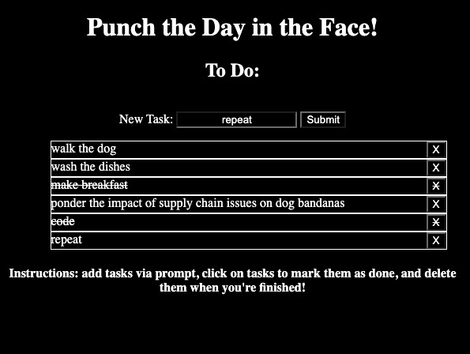

# Punch the Day in the Face! - A To Do List Tracker

 

Add, cross off, and delete tasks for your to-do list with this easy to use app!

 

Click [here to access Punch the Day in the Face!](https://natsal33.github.io/toDoApp/)

 

## Summary
Punch the Day in the Face is a to-do list tracker that takes inputs from the user via text box, generates a new list item from this new task, and either crosses off tasks or deletes them via user input. There is no limit on the amount of list items available to input and the list resets upon refresh of hte page. The pags is in an inverted black and white format to reduce eye strain.

 

##Author

* **Natalie Salazar** - Software Developer in Training